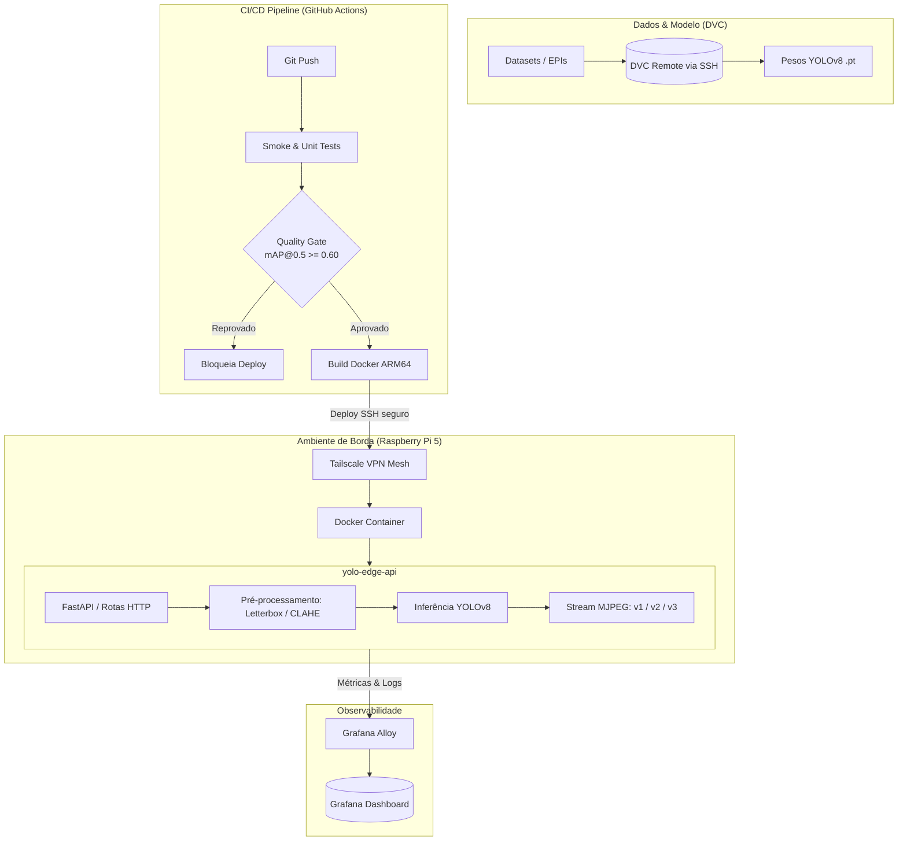

# yolo-edge-api

O **`yolo-edge-api`** é um projeto de **visão computacional embarcada** (*Edge AI*) focado na aplicação prática de **MLOps** para dispositivos de borda. O projeto estabelece uma base sólida para o treinamento, otimização, deploy contínuo e manutenção de modelos de inteligência artificial em ambientes restritos.

- - -

## Propósito

O projeto nasceu durante o [curso de Edge AI do laboratório maker do PNAAT](https://fit-tecnologia.org.br/pnaat/regioes/) na UFCA, com o objetivo de aplicar conceitos fundamentais de **MLOps** em todo o ciclo de vida de um modelo de visão computacional: 

`Dados (Roboflow/DVC) ➔ Código & Modelo (Git/YOLOv8) ➔ CI/CD (GitHub Actions) ➔ Deploy (Docker/Pi 5) ➔ Observabilidade (Alloy/Grafana)`

### Principais Práticas de MLOps

* **Versionamento desacoplado**: Pesos binários (`.pt`) e datasets volumosos não inflam o repositório Git; o projeto utiliza DVC (*Data Version Control*) integrado a um storage remoto via SSH.
* **Estratégia enxuta de dependências (CPU-first para Edge)**: Dispositivos de borda como o Raspberry Pi e os runners de teste não possuem GPU NVIDIA. Baixar a stack CUDA inflaria o ambiente em mais de 3 GB desnecessariamente. O projeto separa os requisitos de forma modular: `requirements.txt` com PyTorch CPU-only (padrão para testes, edge e CI) e `requirements-gpu.txt` exclusivo para estações de treinamento com GPU dedicada.
* **Quality Gate rigoroso**: Novos modelos só avançam para o dispositivo após atingirem a métrica mínima estipulada ($mAP@0.5 \ge 0.60$) no conjunto de validação durante o pipeline de integração contínua.
* **Acesso seguro em redes privadas**: Dispositivos de borda frequentemente operam atrás de CGNAT ou redes locais sem portas públicas expostas. Uma malha Tailscale VPN viabiliza a comunicação direta e segura ponto a ponto com os runners do CI/CD.
* **Resiliência e deploy contínuo**: O deploy automatizado via SSH no Raspberry Pi 5 executa verificações de integridade (*health checks*) pós-inicialização, realizando rollback autônomo para o container anterior caso a nova versão falhe.

Ainda, o `yolo-edge-api` documenta uma esteira completa de engenharia: **treinamento e fine-tuning** de dataset customizado para detecção de EPIs, **pipeline de pré-processamento** (*Letterbox, equalização adaptativa CLAHE e análise de filtros espaciais*), **streaming de vídeo** concorrente (*MJPEG*) e **entrega contínua** focada em hardware restrito.

- - -

## Funcionalidades

- **Inferência REST de alta eficiência**: Detecção de objetos em imagens únicas (Base64 ou URL) e em lote (`/predict/batch`).
- **Respostas visuais anotadas**: Endpoints dedicados para renderização e retorno direto de imagens JPEG com as caixas delimitadoras sobrepostas (`/predict/image` e `/predict/camera/image`).
- **Integração com câmera física na borda**: Captura via interface CSI nativa do Raspberry Pi (`rpicam-still`) ou câmeras USB convencionais (V4L2).
- **Streaming de vídeo em tempo real (MJPEG)**: Feed de vídeo ao vivo com inferência sobreposta por frame (`/stream/camera`) e interface web integrada (`/stream/view`).
- **Pipeline de pré-processamento inteligente**: Redimensionamento com Letterbox (preservando o aspect ratio sem distorcer geometrias), ajuste inverso de bboxes (`adjust_boxes`) e equalização CLAHE para baixa luminosidade.
- **Detecção de EPIs**: Suporte a pesos customizados (`yolo-epi.pt`) para detecção de equipamentos de proteção individual (capacetes, coletes, etc.).
- **Versionamento de artefatos com DVC**: Pesos do modelo e datasets sob controle de versão, sem comprometer o histórico do Git.
- **CI/CD com MLOps completo**: 4 jobs no GitHub Actions cobrindo validação de código, quality gate de performance do modelo, build de imagens ARM64 e deploy com rollback no Raspberry Pi 5.
- **Métricas e observabilidade**: Endpoint `/metrics` com totalizadores de requisições e latência média, complementado por logs em JSON estruturado para indexação.

- - -

## Stack principal

- Python 3.11+
- FastAPI
- Uvicorn
- Ultralytics YOLOv8
- PyTorch (CPU-only para ARM64 / CUDA opcional para treino)
- OpenCV (opencv-python-headless)
- Pillow e NumPy
- DVC (Data Version Control com suporte a SSH)
- Docker e Docker Compose
- GitHub Actions (Buildx, QEMU ARM64)
- Tailscale (Mesh VPN)
- Pytest
- Ruff

- - -

## Arquitetura

### Arquitetura do Sistema



### Estrutura do repositório

```txt
yolo-edge-api/
├── .github/workflows/   # CI/CD: testes, quality gate de mAP, build ARM64 e deploy
├── app/                 # FastAPI: schemas Pydantic, rotas REST e ciclo de vida do modelo
├── preprocessing/       # Otimizações de entrada (Letterbox, CLAHE) e benchmarks
├── stream/              # Streaming MJPEG (v1 naive, v2 threaded, v3 desacoplado)
├── scripts/             # Automação operacional: Quality Gate, deploy e rollback
├── tests/               # Suíte de testes (smoke, unitários, integração e GPU)
├── models/              # Metadados de rastreio DVC (.dvc) para pesos (.pt)
├── dataset/             # Metadados DVC para datasets de EPIs
├── client/              # Cliente de teste para validação das rotas de inferência
└── apostilas/           # Referências conceituais e notas técnicas da disciplina
```

- - -

## API

| Método   | Rota                    | Descrição                                                                 |
| -------- | ----------------------- | ------------------------------------------------------------------------- |
| `GET`    | `/health`               | Retorna o estado de saúde da aplicação e confirmação do modelo carregado. |
| `GET`    | `/metrics`              | Retorna métricas de volume de requisições, sucessos e latência média.     |
| `POST`   | `/predict`              | Executa inferência sobre imagem (Base64 ou URL) e retorna detecções JSON. |
| `POST`   | `/predict/image`        | Executa inferência sobre imagem enviada e retorna JPEG anotado com bboxes. |
| `POST`   | `/predict/camera`       | Captura foto na câmera física (CSI ou USB) e retorna detecções em JSON.   |
| `GET`    | `/predict/camera/image` | Captura foto na câmera física e retorna imagem JPEG anotada com bboxes.   |
| `GET`    | `/stream/camera`        | Transmite feed contínuo de vídeo MJPEG com detecções desenhadas nos frames.|
| `GET`    | `/stream/view`          | Página HTML interativa para visualização do streaming no navegador.       |
| `POST`   | `/predict/batch`        | Processa múltiplas imagens Base64 em lote retornando detecções e tempo.   |

Documentação interativa Swagger UI disponível em `/docs` e ReDoc em `/redoc`.

- - -

## Como rodar localmente

### Requisitos

- Python 3.11+
- Git
- Docker e Docker Compose
- DVC (para sincronização de pesos e datasets)

### Instalar dependências

Crie e ative o ambiente virtual Python:

```bash
python -m venv .venv
# Ativar o ambiente virtual:
# Linux/macOS: source .venv/bin/activate
# Windows: .venv\Scripts\Activate.ps1
```

Escolha o perfil de dependências adequado ao seu cenário:

#### Opção A: CPU-Only / Edge / CI (Padrão e Recomendado)
Ideal para desenvolvimento local, execução de testes automatizados e espelhamento do ambiente do **Raspberry Pi 5**. Instala o PyTorch via repositório CPU oficial (`--extra-index-url https://download.pytorch.org/whl/cpu`), evitando o download de mais de 3 GB de bibliotecas NVIDIA CUDA desnecessárias:

```bash
pip install -r requirements.txt
```

#### Opção B: GPU NVIDIA / Treinamento Local (Opcional)
Exclusivo para estações de trabalho ou servidores equipados com GPU dedicada NVIDIA para acelerar o treinamento e fine-tuning do modelo (`scripts/train_epi.py`):

```bash
pip install -r requirements-gpu.txt
```

### Sincronizar modelo e pesos via DVC

```bash
dvc pull
```

> Baixa os pesos treinados (`models/yolo-epi.pt`), os pesos base (`models/yolov8n.pt`) e o dataset anotado (`dataset/epi-detection/`).

### Iniciar ambiente de desenvolvimento

#### Opção 1: Execução Local (Python)

Inicie a API REST FastAPI:

```bash
uvicorn app.main:app --host 0.0.0.0 --port 8000 --reload
```

A aplicação fica disponível em `http://localhost:8000` (documentação Swagger interativa em `http://localhost:8000/docs`).

Em outro terminal, você pode testar a inferência com o cliente:

```bash
python client/client.py
```

Para iniciar o servidor de streaming MJPEG:

```bash
python stream/mjpeg_server.py --port 5000
```

#### Opção 2: Docker Compose (Ambiente Completo)

Para subir todos os serviços (`yolo-api`, `yolo-client`, `yolo-stream`) com containers baseados em PyTorch CPU-only otimizados para Raspberry Pi (ARM64) e estações de trabalho:

```bash
docker compose up -d
```

Ou iniciar apenas o serviço da API:

```bash
docker compose up -d yolo-api
```

Acompanhe os logs da API em tempo real:

```bash
docker compose logs -f yolo-api
```

Para parar todos os containers:

```bash
docker compose down
```

- - -

## Scripts úteis

| Script                                      | Descrição                                                                      |
| ------------------------------------------- | ------------------------------------------------------------------------------ |
| `uvicorn app.main:app --reload`             | Inicia a API com recarregamento automático em desenvolvimento.                 |
| `python client/client.py`                   | Executa o cliente de teste realizando inferências individual e em lote.        |
| `python stream/mjpeg_server.py`             | Inicia o servidor dedicado de streaming de vídeo MJPEG em tempo real.         |
| `python scripts/inspect_dataset.py`         | Inspeciona integridade, balanceamento de classes e anotações do dataset.       |
| `python scripts/validate_model.py`          | Executa o Quality Gate avaliando se o mAP@0.5 de `yolo-epi.pt` atinge o limiar. |
| `python scripts/train_epi.py`               | Inicia o fine-tuning do modelo YOLOv8 para detecção de EPIs (usar `requirements-gpu.txt`). |
| `python preprocessing/experiments/run_baseline.py` | Avalia o baseline de pré-processamento no dataset `epi-detection`.     |
| `docker compose up -d`                      | Inicia todos os containers da esteira (`yolo-api`, `yolo-client`, `yolo-stream`). |
| `docker compose logs -f yolo-api`           | Exibe os logs estruturados da API em tempo real.                               |
| `docker compose down`                       | Interrompe e remove os containers locais.                                      |
| `dvc pull`                                  | Baixa pesos do modelo e datasets a partir do storage remoto DVC.               |
| `pytest tests/ -v`                          | Executa a suíte de testes automatizados com relatório detalhado.               |
| `ruff check .`                              | Valida regras de lint e boas práticas em todo o repositório.                   |
| `ruff check --fix .`                        | Aplica correções automáticas seguras de estilo e código.                       |
| `ruff format .`                             | Formata todos os arquivos do projeto segundo a PEP 8.                          |
| `bash scripts/deploy.sh`                    | Executa deploy com pull da imagem e rollback automático se falhar.             |

- - -

## Testes

O projeto conta com uma suíte abrangente de testes automatizados com **Pytest** e **Pytest-Cov**, cobrindo 100% dos endpoints REST, esquemas Pydantic, ciclo de vida do modelo, transformações geométricas de pré-processamento e regras de Quality Gate:

1. **Testes de Fumaça (`smoke`)**: Verificação de disponibilidade e formato em `/health` e `/metrics`.
2. **Testes Unitários (`unit`)**:
   - Decodificação de imagens Base64 e validação de dimensões/canais.
   - Schemas Pydantic (`PredictRequest`, `Detection`, `BatchPredictRequest`, etc.).
   - Carregamento, fallback e cache de instâncias YOLO em `app/model.py`.
   - Pipeline de pré-processamento: Letterbox, CLAHE (LAB/HSV), filtros gaussianos/mediana e normalização.
   - Quality Gate: parser de argumentos e validação de limiar em `scripts/validate_model.py`.
3. **Testes de Câmera & Streaming (`camera`)**:
   - Endpoints de captura física CSI/USB (`/predict/camera` e `/predict/camera/image`) com simulação de hardware e falhas.
   - Streaming MJPEG (`/stream/camera` e `/stream/view`) com validação de cabeçalhos multipart e bloqueio de concorrência (`HTTP 409`).
4. **Testes de Integração (`integration`)**:
   - Inferência de imagem via Base64 e URL externa com Ultralytics YOLO (`/predict` e `/predict/image`).
   - Inferência em lote (`/predict/batch`) e persistência acumulada de métricas.

### Executar a suíte de testes

```bash
# Executar todos os testes
pytest

# Executar apenas testes unitários rápidos (sem necessidade de GPU ou modelos pesados)
pytest -m unit

# Executar apenas testes de integração
pytest -m integration

# Executar com relatório de cobertura de código
pytest --cov=app --cov=preprocessing --cov-report=term-missing
```

- - -

## Qualidade de Código (Lint & Formatação com Ruff)

O projeto adota o **Ruff**, linter e formatador de código Python ultrarrápido escrito em Rust, configurado através do [`ruff.toml`](./ruff.toml):

```bash
# Executar inspeção estática no repositório
ruff check .

# Aplicar correções automáticas seguras
ruff check --fix .

# Formatar o código (indentação, quebras e aspas)
ruff format .
```

O linter faz parte do primeiro estágio do pipeline de CI (`edge-deploy.yml`), garantindo que nenhum commit com erros de sintaxe ou violações de boas práticas avance para os jobs de Quality Gate e Deploy.

- - - 

## Documentação

O conteúdo teórico e os estudos práticos do projeto estão organizados em diretórios dedicados:

- [`apostilas/`](./apostilas/): Material didático da disciplina (Aulas 1 a 6), contendo fundamentos de visão computacional, conteinerização Docker, MLOps, CI/CD, Tailscale e arquiteturas Edge AI.
- [`preprocessing/experiments/TABELA.md`](./preprocessing/experiments/TABELA.md): Tabela consolidada com resultados e benchmarks empíricos de pré-processamento (espaço de cor BGR vs RGB, letterbox, filtros de ruído e equalização adaptativa CLAHE para baixa luminosidade).

## Roadmap

### Milestone 1: API REST & Containerização
- [x] Criação dos endpoints de inferência `/predict`, `/predict/batch` e `/health`.
- [x] Suporte a imagens via Base64 e URL externa.
- [x] Dockerfile com PyTorch CPU-only otimizado para ARM64.
- [x] Orquestração local com Docker Compose (`yolo-api`, `yolo-client`).

### Milestone 2: MLOps, CI/CD & Deploy Contínuo
- [x] Versionamento de pesos via DVC desacoplado do Git.
- [x] Pipeline automatizado no GitHub Actions com 4 jobs sequenciais.
- [x] Quality Gate de modelo bloqueando builds com `mAP@0.5 < 0.60`.
- [x] Conexão segura via Tailscale VPN para comunicação direta com o Raspberry Pi 5.
- [x] Deploy automatizado via SSH com health check e rollback autônomo.

### Milestone 3: Câmera Física, Streaming & Otimizações
- [x] Endpoints de captura em câmera física CSI/USB (`/predict/camera` e `/predict/camera/image`).
- [x] Servidor de streaming MJPEG de baixa latência (`/stream/camera` e `/stream/view`).
- [x] Módulo de pré-processamento com Letterbox e mapeamento inverso de coordenadas.
- [x] Equalização CLAHE para ambientes de baixa iluminação.
- [x] Dataset e script de treinamento para detecção de EPIs (`scripts/train_epi.py`).

### Milestone 4: Próximos Passos
- [ ] Exportação e quantização de modelos para INT8 via ONNX Runtime / NCNN.
- [ ] Exportador de métricas Prometheus e dashboards de telemetria no Grafana.
- [ ] Pipeline de retraining contínuo a partir de detecções de baixa confiança em campo.
- [ ] Suporte a múltiplos fluxos de câmera simultâneos com aceleração V4L2.
